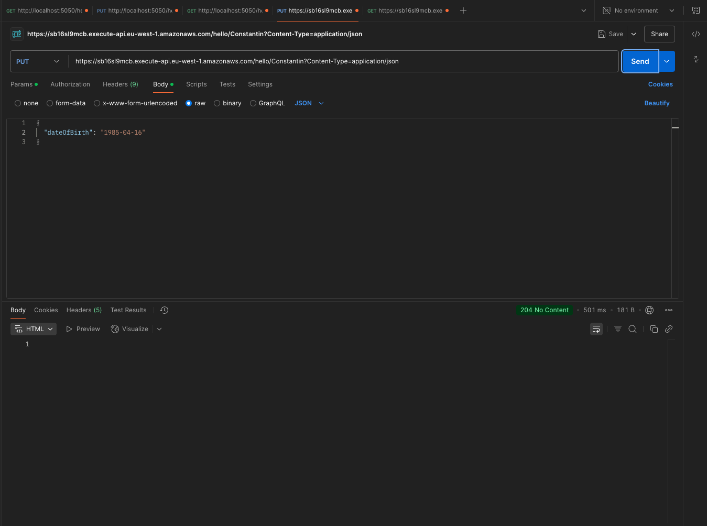
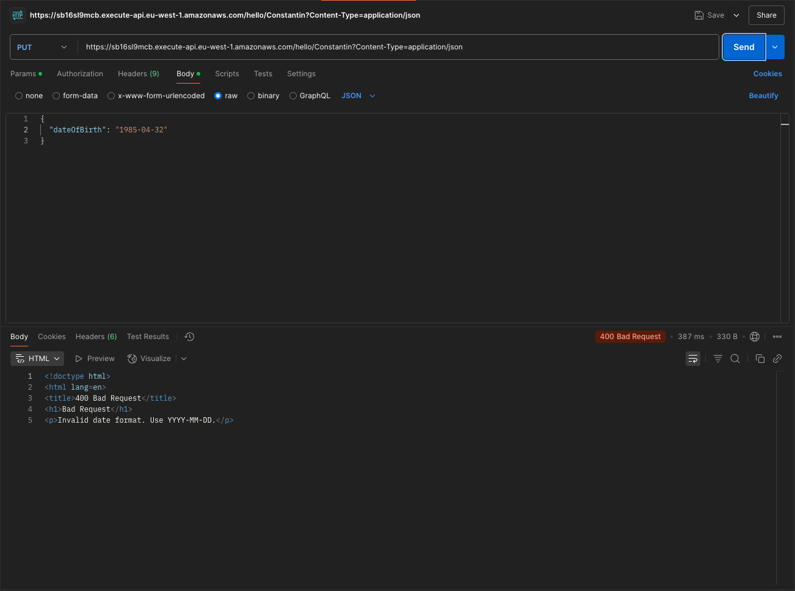
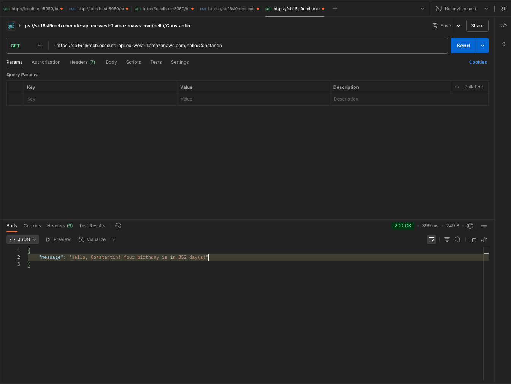
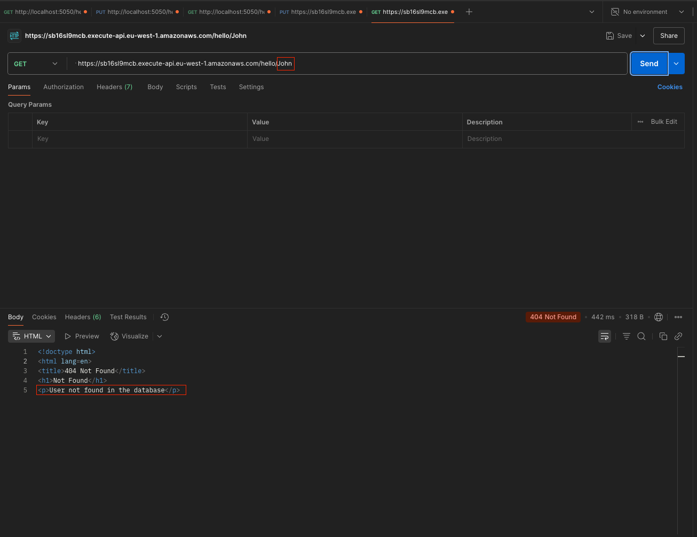
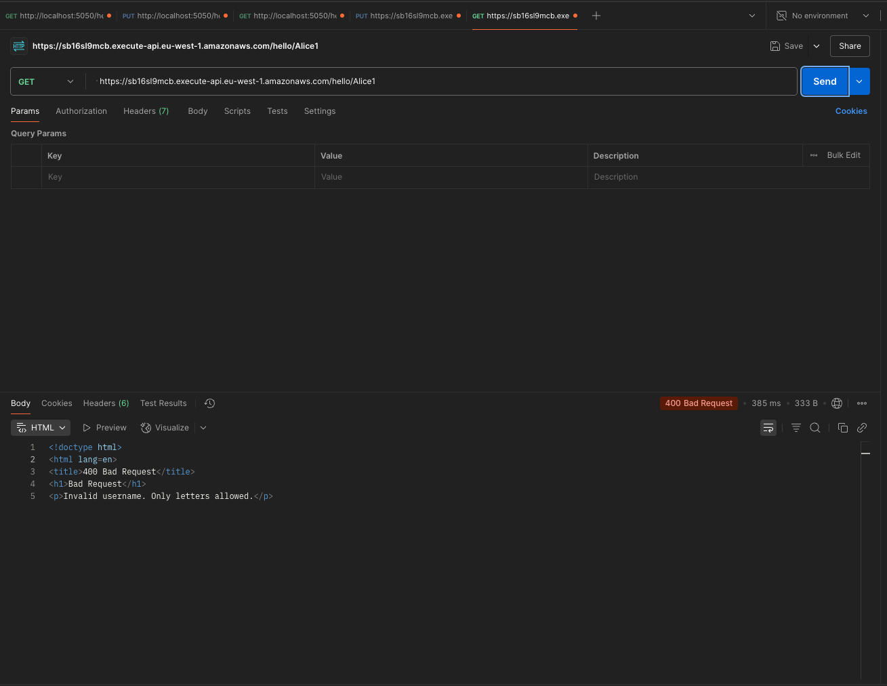

## 📸 Live Demo Screenshots

Demonstrating the behavior of the Hello Birthday API with real request/response examples.

---

### ✅ PUT `/hello/{username}` – Valid Request

Creates or updates a user's date of birth.

---

### ❌ PUT `/hello/{username}` – Invalid Date Format

User submitted a date in an incorrect format.

---

### ✅ GET `/hello/{username}` – Birthday Check Success

Returns a birthday greeting or countdown.

---

### ❌ GET `/hello/{username}` – User Not Found

The requested user is not yet registered.

---

### ❌ GET `/hello/{username}` – Invalid Username

Invalid URL, missing params, etc.

